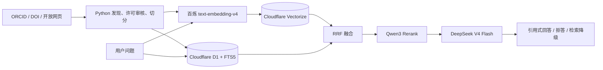

# 链知 ChainScope

面向区块链实验室新生、科研助理与技术学习者的可溯源 RAG 知识中台。在线 Demo：<https://chainscope-lab.shenxinyi-eunice.chatgpt.site>

## 架构



## 产品能力

- 以赵祥福老师 [ORCID 0000-0001-5870-5730](https://orcid.org/0000-0001-5870-5730) 为实验室成果主索引，完整收录40项公开记录。
- 仅对明确开放的HTML/文本和论文摘要建立内容索引；其他论文只展示元数据，不重新分发受版权保护的PDF。
- 百炼 `text-embedding-v4` 1024维向量召回、D1 FTS5/BM25关键词召回、RRF融合、`qwen3-rerank`重排。
- DeepSeek `deepseek-v4-flash` 只根据检索证据回答，每个事实段落必须包含引用编号。
- 低证据、来源冲突、越界问题和提示注入触发拒答；任何模型或向量服务故障时返回真实检索证据。
- 匿名访客每日5次生成额度，全站默认每日200次；超额后检索和引用仍可用。
- 80条版本化评测集，对比关键词、向量、RRF和重排方案；未运行或未达标时如实展示。

## 本地运行

需要 Node.js 22.13+ 与 Python 3.12+：

```bash
pnpm install
pnpm dev
pnpm test
pnpm build
```

数据流水线：

```bash
python pipeline/discover.py
python pipeline/ingest.py
python pipeline/index.py
python pipeline/evaluate.py
```

## 生产配置

复制 `.env.example`。生产值只保存于 Sites 环境变量与 GitHub Actions Secrets：

- `DEEPSEEK_API_KEY`、`DEEPSEEK_BASE_URL`、`DEEPSEEK_MODEL`
- `DASHSCOPE_API_KEY`、`DASHSCOPE_BASE_URL`、`DASHSCOPE_RERANK_URL`
- `CLOUDFLARE_ACCOUNT_ID`、`CLOUDFLARE_VECTORIZE_TOKEN`、`VECTORIZE_INDEX_NAME`
- `INGEST_ADMIN_TOKEN`、`VISITOR_HASH_SALT`、`DAILY_GENERATION_LIMIT`

不得把密钥写入源码、日志、Actions产物或接口响应。

## API

- `POST /api/ask`：引用式回答，返回生成/证据/拒答模式、引用、延迟和剩余额度。
- `GET /api/search`：返回前6个片段及关键词、向量、融合和重排分数。
- `GET /api/sources`、`GET /api/sources/{id}`：成果、许可、索引范围及证据片段。
- `GET /api/evaluations/latest`：最近一次真实评测；无结果时明确返回 `not_run`。
- `POST /api/admin/sync`：使用管理令牌导入审核后的增量语料包。

## 数据治理与限制

状态流转为 `discovered → pending_review → approved → indexing → published`，异常状态为 `rejected / failed / archived`。系统使用DOI、规范化URL和内容哈希去重，只对内容变化的Chunk重新向量化。

首版不处理OCR、图表、公式和非开放全文。引用次数为抓取时快照，不同学术平台的统计口径不可直接混用。评测达到目标前不会在网站或简历中声称达标。

## 许可证

代码使用 [MIT License](LICENSE)。语料、模型与开放稿遵循各自原始许可。
